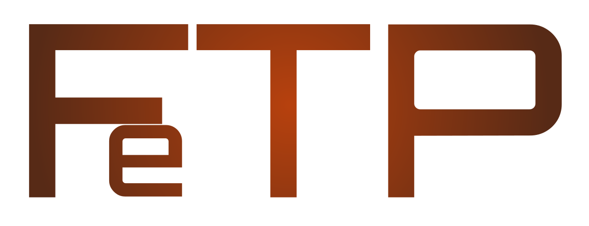

    

# FeTP - A rusty FTP server.

This project mainly serves as a learning project. The purpose of which is to
learn the programming language of Rust. The secondary learning outcome is
that of the inner workings of the FTP protocol.  

## References

- [Protocol description](http://cr.yp.to/ftp.html) by D. J. Bernstein.
- [RFC 959](https://datatracker.ietf.org/doc/html/rfc959)